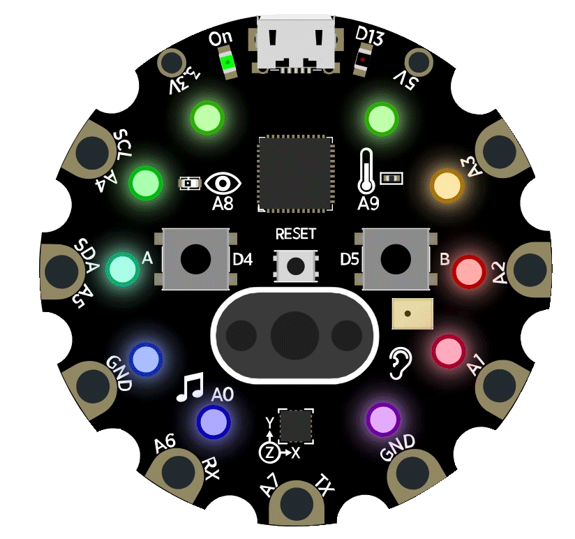
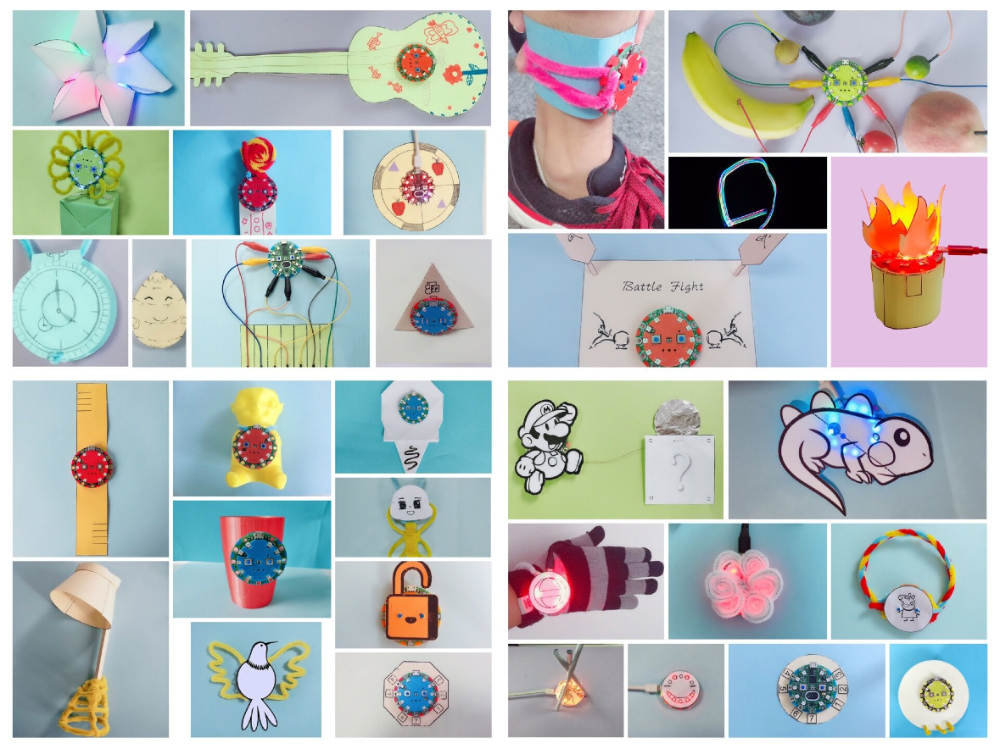

.. _circle_intro:

======================
编程圆简介
======================

一种趣味性的STEAM教学器材，适合5岁以及以上孩子使用的一种迷你型计算机，用编程思维学习、科学探索。编程圆具有七种拟人化的传感器、姿态感知、听觉、视觉、触觉等人体器官功能。
带有音乐、光、颜色的输出。使用图形化编程工具，孩子们可以轻松实现各种“感知-反应”相互作品。

编程圆不是一种工具，而是一种适合STEAM教学的一种教具。支持 `图形化编程工具`_ （HiiBot:circle）和CircuitPython。

.. _图形化编程工具: http://www.hibottoy.com/HiiBotCircle.html

.. image:: ../_static/intro/hardware_view.png