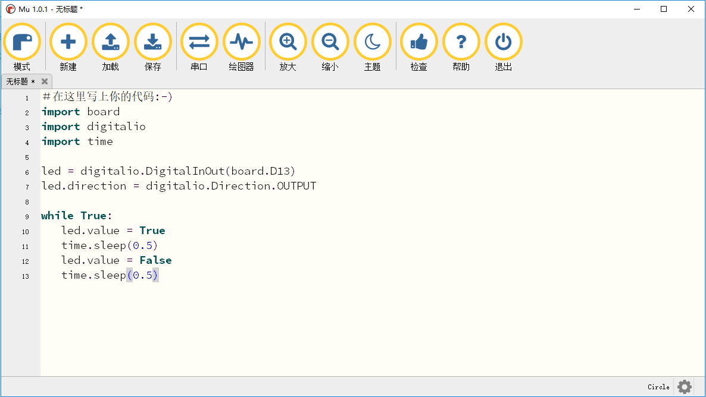

.. _create_editing_code:

===============================
创建和编辑Python代码
===============================

可以用很多文本编辑工具编写python代码，比如系统自带的记事本、`Notepad`_ 等。我们建议使用Mu。Mu支持CircuitPython，并集成了串口控制台，使用简单方便。

.. _Notepad: https://notepad-plus-plus.org

创建代码
+++++++++
打开Mu工具，点击左上角“新建”按钮创建一个文件。

.. image:: ../_static/intro/editor/code_new.png

拷贝并黏贴以下代码到Mu代码编辑窗口

.. code-block:: python
   :linenos:

   import board
   import digitalio
   import time

   led = digitalio.DigitalInOut(board.D13)
   led.direction = digitalio.Direction.OUTPUT

   while True:
      led.value = True
      time.sleep(0.5)
      led.value = False
      time.sleep(0.5)

.. note:: 需要注意while True以下的四行需要缩进对齐

点击“保存”按钮，以文件名“code.py”保存到CIRCUITPY磁盘。

.. image:: ../_static/intro/editor/code_save.png
.. image:: ../_static/intro/editor/code_save1.png

保存成功后，python程序自动运行起来，将能看见红灯在闪。
恭喜你在编程圆上成功运行了第一个Python程序。

编辑代码
+++++++++++++++++++
修改或再次编辑编程圆上的Python程序，点击“加载”按钮，加载CIRCUITPY磁盘上的“code.py”进行修改。

.. image:: ../_static/intro/editor/code_load.png

根据需求修改完可直接保存生效。一旦“code.py”修改并保存了，程序能重新自动启动运行。

.. warning:: 不需要拔除USB或者按“reset”按钮，修改完程序保存就能自动运行。

编程圆会自动检测文件是否修改更新，并自动重启代码。

