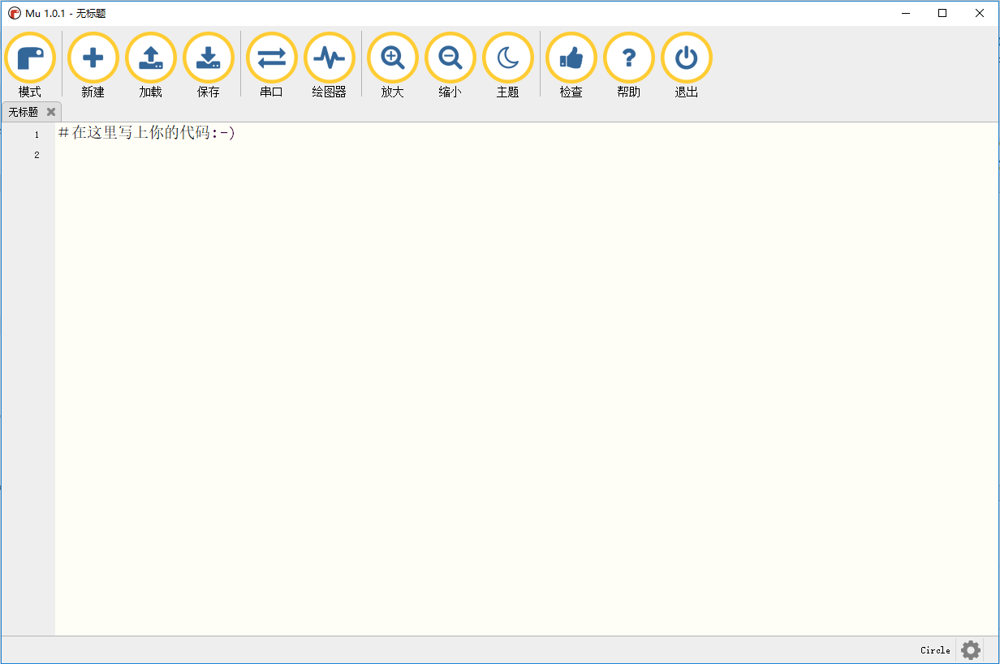
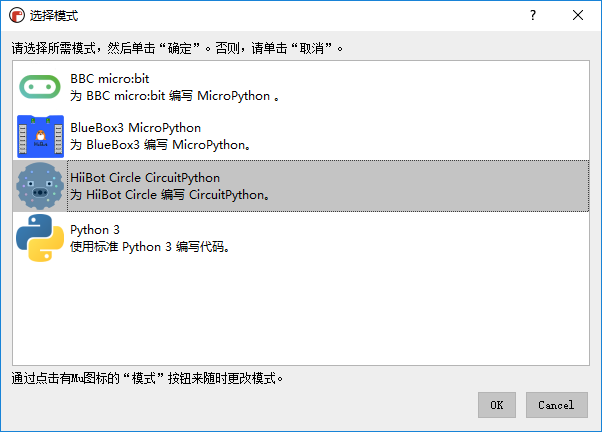
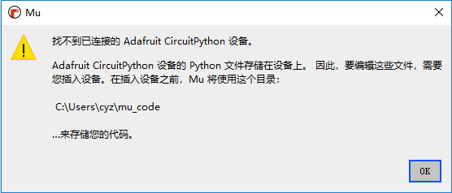

.. _install_mu:

==================================
安装Mu
==================================

Mu 是一个给初学者的 Python 编辑器，它旨在使学习体验更加愉快。它使学生​​能够在早期体验成功，这在你学习任何新知识的时候都很重要。

Mu 是一个用 Python 编写的开源程序，可以在Windows/MacOS/Linux/Raspberry Pi多平台运行。

下载Mu
------------------------
`点击链接`_ 下载安装引导程序，将Mu应用程序安装到本地电脑。

.. _点击链接: http://www.hibottoy.com:8080/static/install/pc/windows/HiiBotCircle/Mu_1.0.1.exe

Mu的使用
------------------------
第一次使用Mu的时候，会弹出模式选择窗口。当前Mu版本支持BBC micro:bit模式、BlueBox3 MicroPython模式、HiiBot Circle CircuitPython模式和Python3模式，
我们当前选择HiiBot Circle CircuitPython模式。

Mu会自动检查插入的开发版，若没有插入开发板会弹出提示未检测到设备。

若将编程圆通过USB插入电脑，Mu将检测到插入的编程圆设备并在Mu界面左下角提示。

.. note:: 检测到新的HiiBot Circle CircuitPython设备。

.. image:: ../_static/mu/mu_device_detect.png
