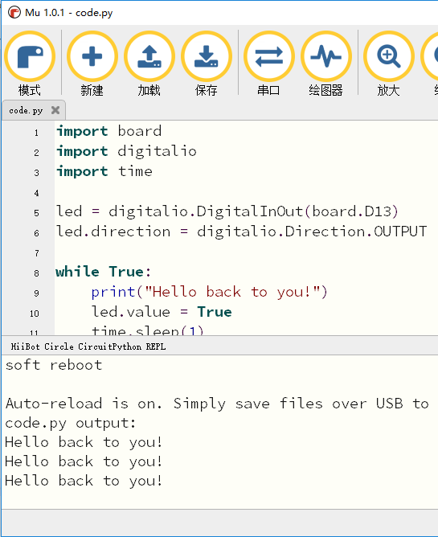

.. _interacting_with_the_serial_console:

===========================
串口控制台交互
===========================

串口控制台
++++++++++++++
编写程序的时候通常会需要输出程序运行中的一些信息，常用的就是print方法，CircuitPython也具备这功能。

.. code:: python

   print("Hello, world!")

这行代码的执行结果就是打印输出“Hello, world!”

.. code:: python
   
   Hello, world!

然而这些打印输出的信息需要有地方呈现，这就是串口控制台的作用了，可以呈现打印输出的信息。
串口控制台通过USB接收编程圆的输出信息并呈现打印信息。所以只要将编程圆通过USB插上电脑就行。

Mu串口控制台
++++++++++++++++
我们可以通过电脑的控制台去连接编程圆的串口输出，也可以使用Mu自带的串口连接编程圆的串口输出。我们建议使用Mu，因为简单方便。

首先我们修改编程圆上的闪灯代码，加入print功能，输出打印一些信息。可以拷贝一下代码并保存。

.. code:: python

   import board
   import digitalio
   import time

   led = digitalio.DigitalInOut(board.D13)
   led.direction = digitalio.Direction.OUTPUT

   while True:
      print("Hello, HiiBot Circle!")
      led.value = True
      time.sleep(1)
      led.value = False
      time.sleep(1)

在Mu下方多出一个控制台窗口，编程圆的打印输出信息都在控制台窗口呈现。

.. image:: ../_static/intro/editor/serial_console_out1.png

可以尝试修改输出信息，保存后查看新的输出信息。

.. code:: python

   import board
   import digitalio
   import time

   led = digitalio.DigitalInOut(board.D13)
   led.direction = digitalio.Direction.OUTPUT

   while True:
      print("Hello back to you！")
      led.value = True
      time.sleep(1)
      led.value = False
      time.sleep(1)
    
