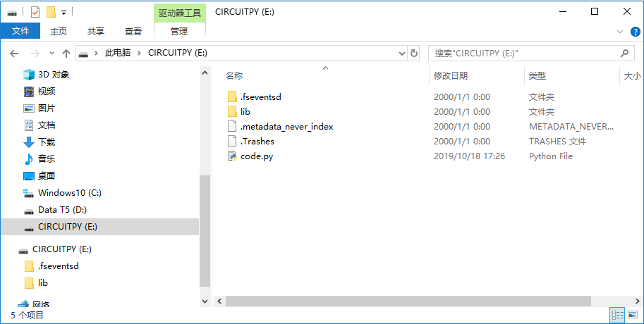

.. _the_circuitpy_drive:

======================
CIRCUITPY磁盘
======================

磁盘文件
+++++++++++++++++

如果编程圆已经正常安装了CircuitPython固件后，插入到电脑时就会出现名为“CIRCUITPY”磁盘。

.. image:: ../_static/intro/mode/circuitpy_drive.png

“CIRCUITPY”磁盘包含了代码文件和需要的库文件，可以直接编辑代码文件并保存就能自动执行最新修改的代码。当然编辑的代码需要保存在名为“code.py”的文件中。

.. note:: 如果磁盘中没有“code.py”文件，可以自行创建一个这样的文件名即可。

磁盘重命名
++++++++++++++++++
当我们需要多个编程圆同时插在电脑上的时候，可能会涉及的重名的问题，因为磁盘名称默认都是“CIRCUITPY”，那就需要对不同的磁盘修改名称来区分。

.. image:: ../_static/intro/drive/rename_drive_win.png

.. image:: ../_static/intro/drive/rename_drive_win1.png